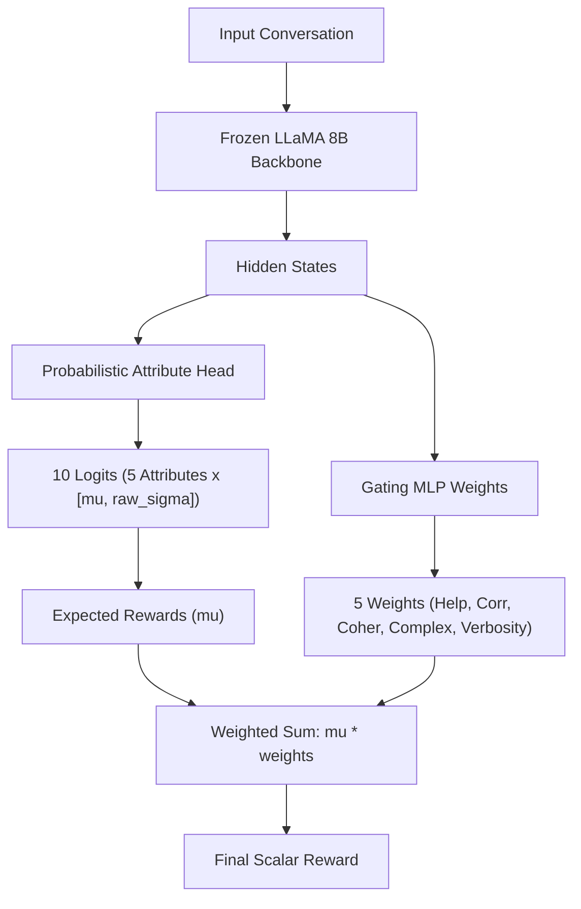

# URM Reverse Engineering Report

This document reports the findings of the reverse engineering analysis performed on the official **Uncertainty-aware Reward Model (URM)** implementation, specifically the `URM-LLaMa-3.1-8B` architecture.

---

## 1. Architecture Overview

The URM extends standard sequence classification models by introducing a probabilistic output head and a dynamic gating network.



---

## 2. Answers to Key Architecture & Design Questions

### Q1: What is the exact shape of the current reward head output?
The sequence classification head (`self.score` in `LlamaForSequenceClassification`) projects the final hidden states to the classification logits:
* **Output Shape**: `[Batch_Size, Sequence_Length, 10]`
* **Pooled Output Shape**: `[Batch_Size, 10]` (using the final non-padded token position index).

### Q2: How are $\mu$ and $\sigma$ represented?
The 10 output dimensions correspond to 5 attributes. They are reshaped to:
`[Batch_Size, 5, 2]`
For each of the 5 attributes:
* **Mean ($\mu$)**: The first value of the pair, i.e., `[:, :, 0]`.
* **Standard Deviation ($\sigma$)**: The second value `[:, :, 1]` represents the log standard deviation ($\text{raw\_}\sigma$).

### Q3: How is $\sigma$ constrained positive?
The standard deviation is computed from $\text{raw\_}\sigma$ using the exponential function:
$$\sigma_i = \exp(\text{raw\_}\sigma_i)$$
This mathematically guarantees $\sigma_i > 0$ for any real-valued $\text{raw\_}\sigma_i$.

### Q4: What loss is used during attribute regression?
During Stage 1 training (attribute regression on the HelpSteer2 dataset), the model computes the Mean Squared Error (MSE) loss between the sampled attribute reward predictions and the ground-truth scores:
$$\mathcal{L}_{\text{regression}} = \frac{1}{5} \sum_{i=1}^5 (r_i - y_i)^2$$
where $r_i$ is the reparameterized sample for attribute $i$, and $y_i$ is the target label.

### Q5: Is reparameterization used?
Yes, reparameterization is utilized to enable gradient propagation through the sampling step:
$$r_i = \mu_i + \epsilon_i \cdot \sigma_i = \mu_i + \epsilon_i \cdot \exp(\text{raw\_}\sigma_i)$$
where $\epsilon_i \sim \mathcal{N}(0, 1)$ is a standard normal variable.

### Q6: How are the five attributes stored?
The attributes are stored sequentially across the first dimension of shape `[B, 5, 2]`. The indices are mapped as:
1. Index `0`: **Helpfulness**
2. Index `1`: **Correctness**
3. Index `2`: **Coherence**
4. Index `3`: **Complexity**
5. Index `4`: **Verbosity**

### Q7: How is the gating network trained?
The gating network is represented by the `Weights` class, which is a 3-layer MLP:
* **Input**: Frozen LLaMA backbone hidden states (`hidden_size=4096`).
* **Layers**: `Linear(4096, 4096) -> SELU() -> Linear(4096, 4096) -> SELU() -> Linear(4096, 5)`.
* **Stage 2 Training**: The LLaMA backbone and attribute head are frozen. Only the gating network weights are optimized on the Skywork preference dataset using the Bradley-Terry preference loss.

### Q8: What exact BT loss implementation is used?
The Bradley-Terry (BT) loss compares the final scalar scores of the chosen (winning) response $s_w$ and the rejected (losing) response $s_l$:
$$\mathcal{L}_{\text{BT}} = -\log \sigma(s_w - s_l)$$
The scores $s$ are the dot product of attribute expected rewards (means) and gating weights:
$$s = \sum_{j=1}^5 \mu_j \cdot w_j$$

### Q9: How are weights normalized?
They are **not normalized**. The gating network outputs raw unbounded scores which are directly multiplied by the attribute expected rewards. There is no softmax, sigmoid, or normalization applied.

### Q10: Is softmax applied to gating outputs?
No. Gating weights are direct raw outputs from the final linear layer of `self.weights`.

---

## 3. Code References

From [modeling_custom.py](file:///home/f20221218/URM-LLaMa-3.1-8B/modeling_custom.py):

* **Gating MLP weights definition**:
```python
class Weights(torch.nn.Module):
    def __init__(self):
        super().__init__()
        self.fc=torch.nn.Sequential(
                    torch.nn.Linear(4096,4096,dtype=torch.float16),
                    torch.nn.SELU(),
                    torch.nn.Linear(4096,4096,dtype=torch.float16),
                    torch.nn.SELU(),
                    torch.nn.Linear(4096,5,dtype=torch.float16)
        )
```

* **Aggregation forward pass**:
```python
        rews=pooled_logits.view(-1,5,2)[:,:,0].view(-1,5)
        scores=(rews*pooled_weights).sum(dim=-1).view(-1,1)
```
